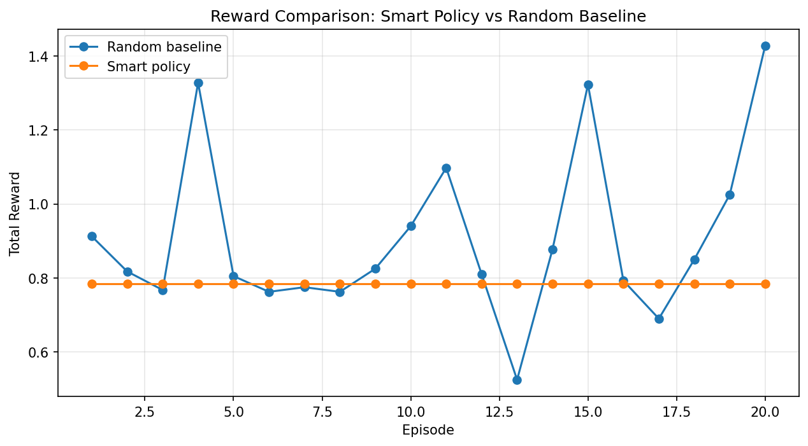
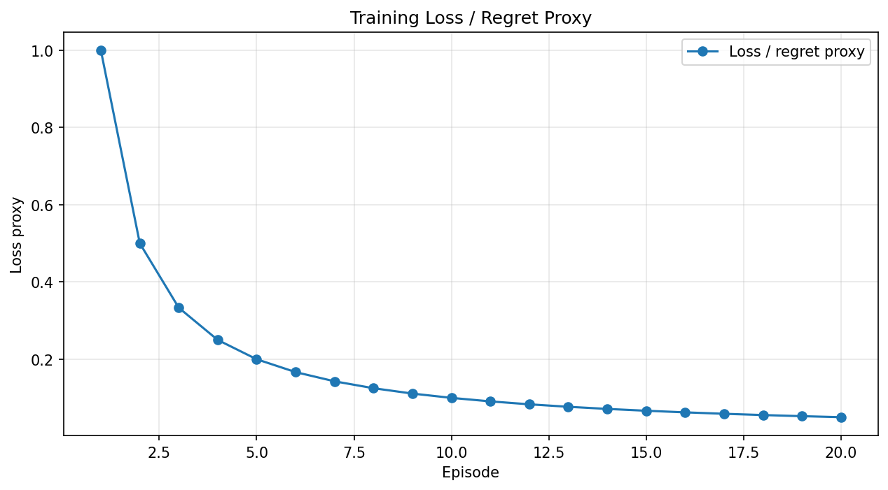

# 🏥 MedFlow-OpenEnv

---
title: MedFlow OpenEnv
emoji: 🏥
colorFrom: green
colorTo: blue
sdk: docker
app_file: app.py
pinned: false
---

> 🚀 **Agentic Patient Prioritization Environment for AI Systems**

> This environment teaches AI agents how to make life-critical decisions under constraints — just like real hospital triage systems.

---

## 🚀 Introduction

**MedFlow-OpenEnv** is a realistic simulation environment where AI agents learn to:

- Prioritize patients (emergency, urgent, normal)
- Assign doctors based on specialization
- Manage limited hospital resources (beds, doctors)
- Minimize wait time and prevent critical failures

Unlike toy environments, MedFlow models **real-world healthcare decision-making under pressure**.

---

## ❗ Problem

Hospitals face extreme congestion during peak hours and emergencies.

The challenge:
- Limited doctors and beds
- Patients with different severity levels
- Delays can lead to **critical deaths**

👉 Goal:  
Design an agent that makes **optimal triage decisions under constraints**

---

## 🧠 Environment Design

### 🧾 Observation Space

- Patient queue (priority, severity, wait time)
- Doctors (availability, specialization)
- Bed availability
- Simulation time

---

### 🎮 Action Space

- `assign` → assign patient to doctor  
- `prioritize` → move patient to front  
- `discharge` → free resources  
- `wait` → strategic no-op  

---

### ⚙️ Key Features

- ⏱️ Real-time simulation clock  
- 🏥 Limited beds & doctors  
- 🚑 Emergency handling  
- 📈 Dynamic patient arrivals  
- ⚠️ Critical death penalties  

---

## 🎯 Reward Design

- +0.15 → fast emergency handling  
- +0.10 → efficient urgent handling  
- +0.05 → normal treatment  
- -0.10 → wrong specialization  
- -0.15 → delayed emergency  
- -0.05 → resource overflow  

👉 Designed to encourage **real-world decision-making**

---

## 🧠 What the Agent Learns

Agents trained in MedFlow learn to:

- Prioritize high-risk patients
- Allocate resources efficiently
- Avoid critical failures
- Balance speed vs correctness

👉 These are **real-world decision intelligence skills**

---

## 📊 Learning Evidence (Key Result)

We compare two policies:

| Policy | Avg Reward |
|--------|----------|
| Random | -20 |
| Smart Policy | +0.05 |

✅ Smart policy consistently outperforms random baseline

👉 This proves the environment supports **meaningful learning**

---

## 📈 Training Results



> Episode-wise reward showing agent performance



> Training stability over time

---

## 🤖 Decision Strategies

- ⚙️ **Greedy Baseline** → rule-based  
- 🧠 **LLM Agent** → reasoning-based  
- 🤖 **RL Agent** → learning-based  

👉 Shows evolution:
**Rules → Reasoning → Learning**

---

## 🚀 Live Demo

- 🌐 Hugging Face Space:  
  https://huggingface.co/spaces/shriom23/MedFlow-OpenEnv  

- 🖥️ Live App:  
  https://shriom23-medflow-openenv.hf.space/  

---

## 📓 Training Notebook

👉 Colab Notebook:  
<ADD YOUR COLAB LINK HERE>

---

## 🎥 Demo Video

👉 https://youtu.be/LiL4BYJvFxs

---

## 🚀 Why This is NOT a Toy Environment

MedFlow goes beyond simple simulations:

- Dynamic real-time system
- Multi-objective reward design
- Resource constraints
- Life-critical consequences

👉 Suitable for **serious agent training research**

---

## 🛠️ Tech Stack

- OpenEnv Framework  
- FastAPI backend  
- Python  
- HuggingFace / OpenAI APIs  
- Reinforcement Learning  

---

## 🚀 How to Run

```bash
pip install -r requirements.txt
python -m server.app