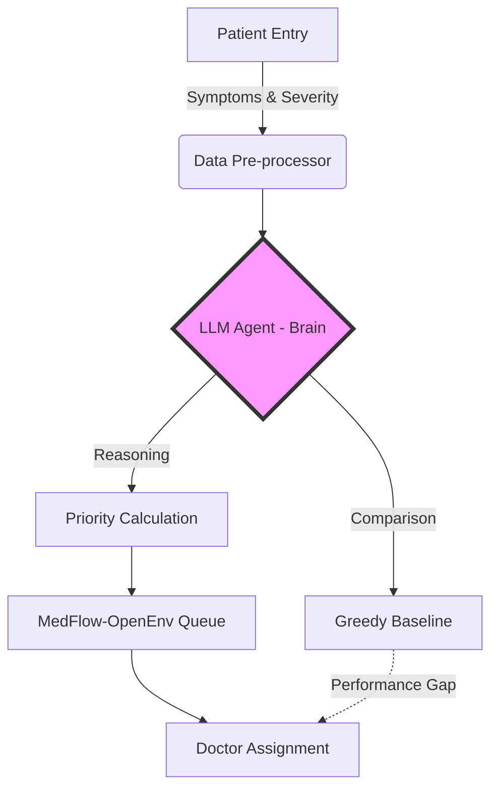

# Agentic Patient Prioritization System (OpenEnv)

> **Note:** The code expects an `OPENAI_API_KEY` or `HF_TOKEN` as an environment variable to run the LLM-based agent. No API key is included in this repository.

MedFlow-OpenEnv is not just a "queue management" simulator—it's an **Agentic Patient Prioritization System**. Here, your AI agent must make intelligent, context-aware decisions, going beyond FIFO logic to demonstrate true medical triage intelligence. This is designed for next-gen agentic AI research, where decision quality and reasoning matter most.

## 1. Project Overview & Agentic Vision

**Why "Agentic"?**
Meta and modern AI research demand agents that can reason, prioritize, and adapt—not just process queues. This environment challenges your agent to:
- Recognize patient severity and urgency
- Allocate resources smartly (doctors, beds)
- Minimize critical wait times
- Justify its actions with context

Your agent is evaluated on its ability to "think" like a real triage expert, not just follow rules.

## 2. Environment Logic (The 'Core')

**Observation Space:**
- Patient severity, priority, and wait time
- Available doctors (specialization, busy/free)
- Bed availability
- Current simulation time

**Action Space:**
- Assign patient to specific doctor
- Move patient to top of queue (prioritize)
- Discharge patient (free up bed)
- Wait (no action)

**Reward Function (Conceptual):**
- **+0.15**: Emergency patient assigned within 5 min
- **+0.10**: Urgent patient assigned within 10 min
- **+0.05**: Normal patient assigned
- **-0.10**: Wrong specialization assigned
- **-0.15**: Emergency patient left waiting >5 min (per step)
- **-0.05**: Bed overflow attempted
- **0.0**: Wait action
- **Final**: Grader score based on overall episode stats (avg wait, deaths, etc)

## 3. LLM-Based Decision Making vs. Greedy Baseline

**Greedy Baseline (The Old Way):**
- Simple FIFO বা specialization-matching logic
- No deep reasoning—just "first come, first served" বা basic rules

**LLM Agent (Your Way):**
- Uses prompt engineering and LLM (GPT-3.5/4/4o) to interpret patient context
- Can "sense" which patient is most critical, even if not first in line
- Demonstrates "Vibe Coding" intelligence—reasoning beyond hardcoded rules

**No RL (Reinforcement Learning) yet:**
- This project currently does **not** use RL. All agentic behavior is via LLM or greedy logic.

## 4. Tech Stack & Tooling

- **Framework:** Meta PyTorch OpenEnv
- **Brain:** OpenAI Models (GPT-3.5, GPT-4, GPT-4o)
- **Automation:** Built with AI Agents (e.g., Copilot, Cursor, Claude)

## 5. How to Run (Crucial for Selection)

1. **Install dependencies:**
   ```bash
   pip install -r requirements.txt
   ```
2. **Set your API key:**
   - Create a `.env` file in the project root:
     ```env
     OPENAI_API_KEY=your_openai_api_key_here
     ```
3. **Run a simulation:**
   - Greedy baseline:
     ```bash
     python -m app.baseline --seed 42
     ```
   - LLM agent (OpenAI):
     ```bash
     python -m app.baseline_openai --seed 42
     ```
   - Custom inference (submission):
     ```bash
     python inference.py --seed 42
     ```

---


## 6. Agentic Flow Diagram



**Built for agentic AI research.**
For questions, see the code or open an issue!
