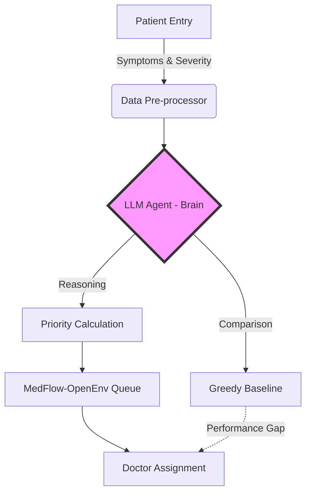

# Agentic Patient Prioritization System (OpenEnv)


> **Note:** The system is built to support LLM Agents via OpenAI/HuggingFace APIs.  
> A local Greedy Baseline is provided for quick demonstration and benchmarking.

MedFlow-OpenEnv is not just a "queue management" simulator — it's an **Agentic Patient Prioritization System** built on top of OpenEnv.  
Here, AI agents must make intelligent, context-aware decisions, going beyond FIFO logic to demonstrate real-world triage intelligence.

---

## 1. Project Overview & Agentic Vision

**Why "Agentic"?**

Modern AI systems are moving toward **agentic decision-making**, where models must reason, adapt, and prioritize dynamically.  

This environment challenges your agent to:

- Recognize patient severity and urgency  
- Allocate resources intelligently (doctors, beds)  
- Minimize critical wait times  
- Make context-aware decisions under constraints  

Your agent is evaluated on its ability to **think like a real triage expert**, not just follow rules.

---

## 2. Environment Logic (The Core)

### Observation Space
- Patient severity, priority, and wait time  
- Available doctors (specialization, busy/free)  
- Bed availability  
- Current simulation time  

### Action Space
- Assign patient to a doctor  
- Move patient to top of queue (prioritize)  
- Discharge patient (free up resources)  
- Wait (no action — may be strategic)  

---

## 3. Reward Function (Conceptual)

- **+0.15** → Emergency patient assigned within 5 min  
- **+0.10** → Urgent patient handled efficiently  
- **+0.05** → Normal patient treated  
- **-0.10** → Wrong specialization  
- **-0.15** → Emergency delay penalty  
- **-0.05** → Bed overflow attempt  
- **0.0** → Wait  

**Final Score:**
- Average wait time  
- Emergency response time  
- Throughput  
- Critical failures  

---

## 4. LLM-Based Decision Making vs Greedy Baseline

### Greedy Baseline (Traditional)
- FIFO / simple rules  
- No reasoning  
- Limited performance  

### LLM Agent (Agentic Approach)
- Uses GPT-style reasoning  
- Understands patient context  
- Makes smarter prioritization decisions  
- Demonstrates true **agent intelligence**  

> No Reinforcement Learning yet — purely reasoning-based agents.

---

## 5. Tech Stack & Tooling

- **Framework:** OpenEnv  
- **Backend:** FastAPI  
- **Core Logic:** Python  
- **Agent Layer:** OpenAI / HuggingFace APIs  
- **Testing:** Pytest (40+ test cases)  

---

## 6. How to Run

1. **Install dependencies:**
   ```bash
   pip install -r requirements.txt
   ```
2. **Set your API key:**
   - Create a `.env` file in the project root:
     ```env
     OPENAI_API_KEY=your_openai_api_key_here
     ```
3. **Run a simulation:**
   - Greedy baseline:
     ```bash
     python -m app.baseline --seed 42
     ```
   - LLM agent (OpenAI):
     ```bash
     python -m app.baseline_openai --seed 42
     ```
   - Custom inference (submission):
     ```bash
     python inference.py --seed 42
     ```

---


## 7. Agentic Flow Diagram



**Built for agentic AI research.**
For questions, see the code or open an issue!
