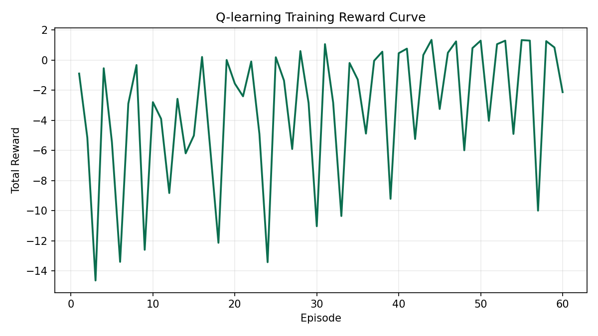
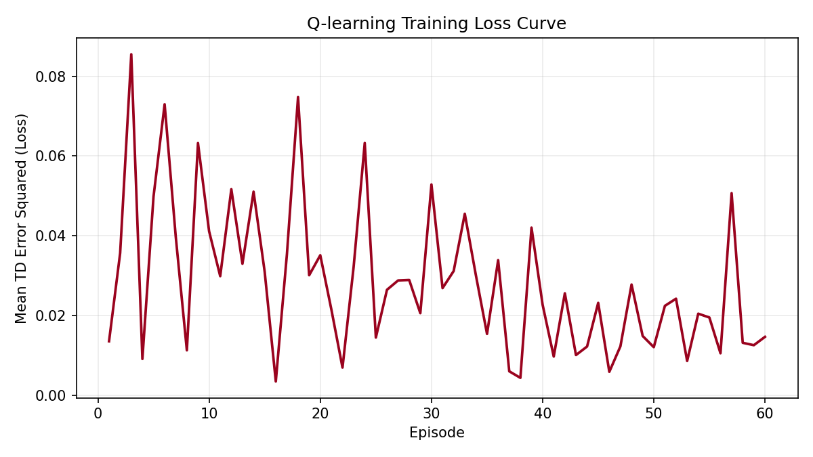
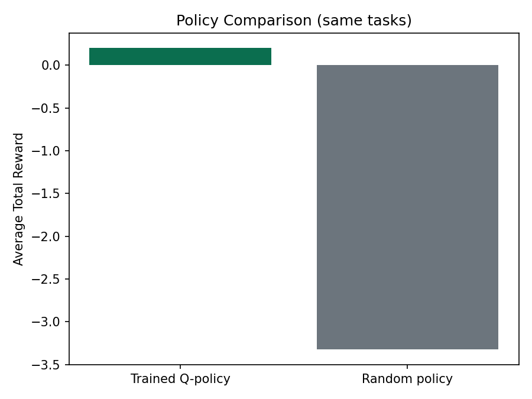
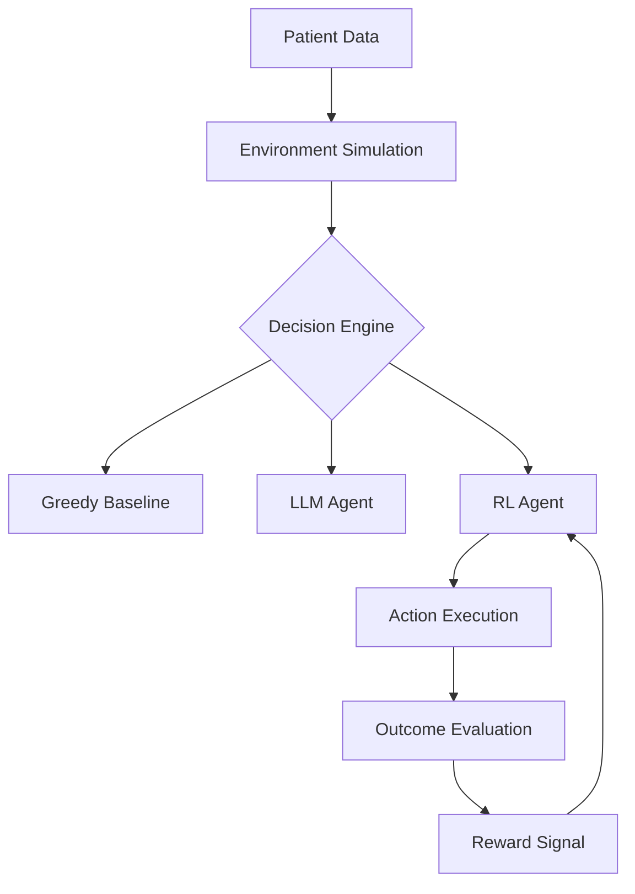

---

title: MedFlow OpenEnv
emoji: 🏥
colorFrom: green
colorTo: blue
sdk: docker
pinned: false
license: mit
short_description: Agentic Patient Prioritization System for AI agents
---

# 🏥 Agentic Patient Prioritization System (OpenEnv)


> **Note:** The system supports LLM-based agents via OpenAI/HuggingFace APIs and now includes a Reinforcement Learning (RL) agent for adaptive decision-making.
> A Greedy Baseline is provided for benchmarking.

---

## 🚀 Introduction

**MedFlow-OpenEnv** is an advanced simulation environment for **intelligent patient triage and resource allocation** under real-world constraints.

Unlike traditional queue systems, MedFlow enables **agentic AI systems** to reason, adapt, and learn in dynamic healthcare scenarios.

The system integrates multiple AI paradigms:

* ⚙️ **Greedy Baseline** → fast but rule-based
* 🧠 **LLM Agent** → context-aware reasoning
* 🤖 **RL Agent** → reward-driven learning and adaptation

> 💡 This progression demonstrates the evolution from **static rules → reasoning → learning-based intelligence**.

---

## Project Overview

MedFlow-OpenEnv simulates a hospital triage pipeline where multiple patient types compete for limited doctors and beds.
The project benchmarks three decision strategies in the same environment:

* Greedy baseline for deterministic rules
* LLM policy for context-aware triage decisions
* RL policy for reward-based adaptation

## Problem Statement

Hospitals face queue congestion during busy OPD windows and emergency surges.
The core optimization problem is to reduce emergency waiting time while preserving overall throughput under capacity constraints.

Success means balancing:

* low wait time for high-priority patients
* valid doctor-specialization assignment
* stable bed utilization
* fewer invalid or delayed actions

## How It Works (OpenEnv + LLM)

1. OpenEnv produces a structured observation with queue, doctors, beds, and time context.
2. The inference policy builds a compact prompt from that observation.
3. The LLM returns a strict JSON action: assign, prioritize, discharge, or wait.
4. The environment validates and executes the action, then emits reward and feedback.
5. Logs are emitted in validator-friendly START/STEP/END format.

## API Endpoints

* `GET /` : **interactive dashboard** for task selection, action testing, and live observation
* `GET /api` : service metadata and useful API info links
* `GET /health` : service health payload
* `GET /docs` : interactive Swagger API documentation
* `GET /openapi.json` : OpenAPI schema

### Interactive UI (`/` - Default Landing Page)

The dashboard is now served at the root path and supports:

- Start `easy_small_clinic`, `medium_busy_opd`, `hard_mass_casualty` directly from UI
- Run actions from UI: `assign`, `prioritize`, `discharge`, `wait`
- Live observation tables (waiting patients, doctors, reward, progress)
- Modern dark-glass design with responsive layout
- Real-time patient/doctor status updates

## Demo Flow

1. Start the API service (Hugging Face Space or local Docker runtime).
2. Open `/docs` to inspect endpoints.
3. Run `python inference.py --seed 42 --tasks easy_small_clinic medium_busy_opd hard_mass_casualty`.
4. Observe structured logs for each step and final score per task.

## How To Run

Use these commands from the repository root:

```bash
python -m server.app
python scripts/benchmark_medflow.py --episodes 3
python scripts/greedy_policy.py --episodes 3
python scripts/train_qlearning.py --episodes 60 --eval-episodes 2 --outdir outputs/evals
python train/train_hftrl.py --out hftrl_colab.md
python -m train.train_unsloth --env app.env --episodes 1 --demo
```

If you want a quick sanity check of the API surface after starting the server:

```bash
python test_api.py
```

The benchmark writes results to `outputs/benchmarks/benchmark_summary.json` and
`outputs/benchmarks/benchmark_summary.md`.

## How To Present To Judges

1. Start with the problem: dynamic hospital triage under partial observability, limited beds, and specialist routing.
2. Show the live API or dashboard first, then open the benchmark summary to prove the environment is measurable.
3. Compare greedy vs random scores, and point to the step logs and final scores as evidence of feedback-driven behavior.
4. Call out the judge-friendly artifacts: structured tasks, API endpoints, log files, and reproducible benchmark commands.
5. End with the takeaway: this is not a toy prompt demo; it is an interactive world model with state, time, and consequences.

Demo video: [Demo: MedFlow End-to-End Triage Run](https://youtu.be/LiL4BYJvFxs)

## Submission Links (Judges)

- Hugging Face Space: https://huggingface.co/spaces/shriom23/MedFlow-OpenEnv
- Live App: https://shriom23-medflow-openenv.hf.space/
- API Docs: https://shriom23-medflow-openenv.hf.space/docs
- Demo Video (<2 min): https://youtu.be/LiL4BYJvFxs
- Colab-ready TRL template: `hftrl_colab.md`

## Real Training Evidence

The following artifacts are generated from a real local training run:

```bash
python scripts/train_qlearning.py --episodes 60 --eval-episodes 2 --outdir outputs/evals
```

- Per-episode metrics: `outputs/evals/training_metrics.csv`
- Training summary: `outputs/evals/training_summary.json`
- Reward curve: `outputs/evals/training_reward_curve.png`
- Loss curve: `outputs/evals/training_loss_curve.png`
- Trained-vs-random comparison: `outputs/evals/training_policy_compare.png`



Caption: Episode-wise total reward during Q-learning training.



Caption: Mean TD error squared (loss proxy) per training episode.



Caption: Average total reward comparison on the same task set after training.

## Reward Graph


## LLM Usage in MedFlow

The LLM is used specifically for action selection in triage state transitions.

* **Decision making:** chooses the next valid operational action.
* **Queue optimization:** prioritizes urgent/emergency cases under limited capacity.
* **Operational suggestion:** when assignment is risky/invalid, model can return safe fallback actions.

For validator compliance, calls are routed through injected proxy variables (`API_BASE_URL` and `API_KEY`) in `inference.py`.

### 🔐 LLM Proxy Compliance

All LLM calls are strictly routed through the provided LiteLLM proxy:

- Uses `API_BASE_URL` and `API_KEY` from environment variables
- No hardcoded API keys
- Compatible with OpenAI SDK via proxy

```python
client = OpenAI(
  base_url=os.environ["API_BASE_URL"],
  api_key=os.environ["API_KEY"],
)
```

✅ This ensures full compliance with Phase 2 validation requirements.

## 📈 Why MedFlow is Powerful

### 💡 Key Strengths

- Supports **multi-agent decision strategies** (Greedy vs LLM vs RL)
- Fully **OpenEnv-compatible** (plug-and-play environment)
- Real-world inspired **hospital triage simulation**
- Designed for **scalability and extensibility**
- Demonstrates **evolution of AI systems**: Rules → Reasoning → Learning

## Sample Request/Response (Conceptual)

Example LLM action payload expected by inference:

```json
{
  "action_type": "assign",
  "patient_id": 12,
  "doctor_id": 2
}
```

Example STEP log line emitted by runtime:

```text
[STEP] step=7 action=assign(patient_id=12,doctor_id=2) reward=0.10 done=false error=null
```

## Real-World Use Case

In a mass-casualty intake window, MedFlow can evaluate triage policies to identify safer admission/assignment behavior before deploying decision support rules in production hospital systems.

---

## 1. Project Overview & Agentic Vision

Modern AI is shifting toward **agentic systems** that can think, adapt, and optimize decisions dynamically.

MedFlow challenges agents to:

* Recognize patient severity and urgency
* Allocate resources intelligently (doctors, beds)
* Minimize critical wait times
* Operate under real-world constraints

👉 The goal:
**Build agents that behave like real triage experts, not rule-followers.**

---

## 2. Environment Logic (Core RL-Compatible Design)

### 🔹 Observation Space (State)

* Patient severity, priority, wait time
* Available doctors (specialization, status)
* Bed availability
* Current simulation time

---

### 🔹 Action Space

* Assign patient to doctor
* Prioritize patient in queue
* Discharge patient
* Wait (strategic no-op)

---

### 🔹 Reward Function

* **+0.15** → Emergency handled quickly
* **+0.10** → Efficient urgent handling
* **+0.05** → Normal treatment
* **-0.10** → Wrong specialization
* **-0.15** → Emergency delay
* **-0.05** → Resource overflow
* **0.0** → Wait

👉 This reward structure enables **Reinforcement Learning optimization**.

---

## 3. Decision-Making Paradigms

### 🔹 Greedy Baseline

* FIFO / rule-based
* No reasoning
* Limited adaptability

### Greedy Output

---

### 🔹 LLM Agent (Agentic Reasoning)

* Uses GPT-style reasoning
* Context-aware decision-making
* Flexible and intelligent

### LLM Output

---

### 🔹 RL Agent (Learning-Based)

* Implemented in `rl_agent.py`
* Uses **state → action → reward loop**
* Learns optimal policies via feedback
* Adapts to complex scenarios over time

### RL Output

---

### 📊 RL Evaluation Snapshot

```
[Task: easy_small_clinic] → Reward: 0.35  
[Task: medium_busy_opd] → Reward: 0.7  
[Task: hard_mass_casualty] → Reward: -2.35  
⚠️ Needs improvement  
```

> Lower performance in high-complexity scenarios highlights opportunities for further learning and optimization.

---

## 4. System Architecture



👉 Modular design enables **plug-and-play intelligence layers**.

---

## 5. Tech Stack & Tooling

* **Framework:** OpenEnv
* **Backend:** FastAPI
* **Core Logic:** Python
* **Agents:** OpenAI / HuggingFace APIs + RL Agent
* **Testing:** Pytest (40+ test cases)

---

## 6. Deployment (Hugging Face Space)

* **Space Page:** https://huggingface.co/spaces/shriom23/MedFlow-OpenEnv
* **Dashboard UI:** https://shriom23-medflow-openenv.hf.space/ (root serves the interactive dashboard)
* **API Docs:** https://shriom23-medflow-openenv.hf.space/docs
* **Health Check:** https://shriom23-medflow-openenv.hf.space/health
* **OpenAPI Schema:** https://shriom23-medflow-openenv.hf.space/openapi.json

---

## 7. How to Run

```bash
pip install -r requirements.txt
```

Create `.env`:

```env
API_BASE_URL=https://your-litellm-proxy/v1
API_KEY=your_proxy_api_key
MODEL_NAME=Qwen/Qwen2.5-72B-Instruct
```


### Run simulations:


```bash
python inference.py --seed 42 --tasks easy_small_clinic medium_busy_opd hard_mass_casualty
```

**Greedy baseline**

```bash
python -m app.baseline --seed 42
```

**LLM agent**

```bash
python -m app.baseline_openai --seed 42
```

**RL agent**

```bash
python -m app.rl_agent --tasks easy_small_clinic medium_busy_opd hard_mass_casualty --seed 42
```

### Pre-submit checklist (Validation)

- `API_BASE_URL`, `API_KEY`, and `MODEL_NAME` are set in the Space environment.
- Latest commit is pushed and Space rebuild is complete.
- `python inference.py` runs successfully with the proxy configuration.

---

## 🎯 Design Philosophy

> Build once → plug multiple intelligence layers → compare reasoning vs learning vs rules.

---

## 🔮 Future Scope

* Scale current Q-learning baseline to Deep RL (PPO/DQN) with larger action search
* Hybrid LLM + RL agent
* Real-world hospital dataset integration

---

**Built for next-generation agentic AI systems 🚀**
