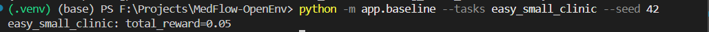
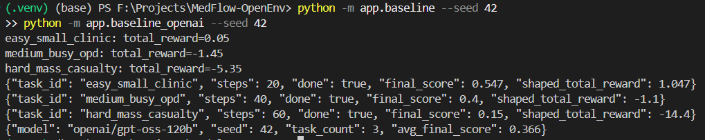
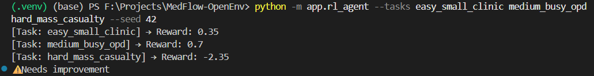
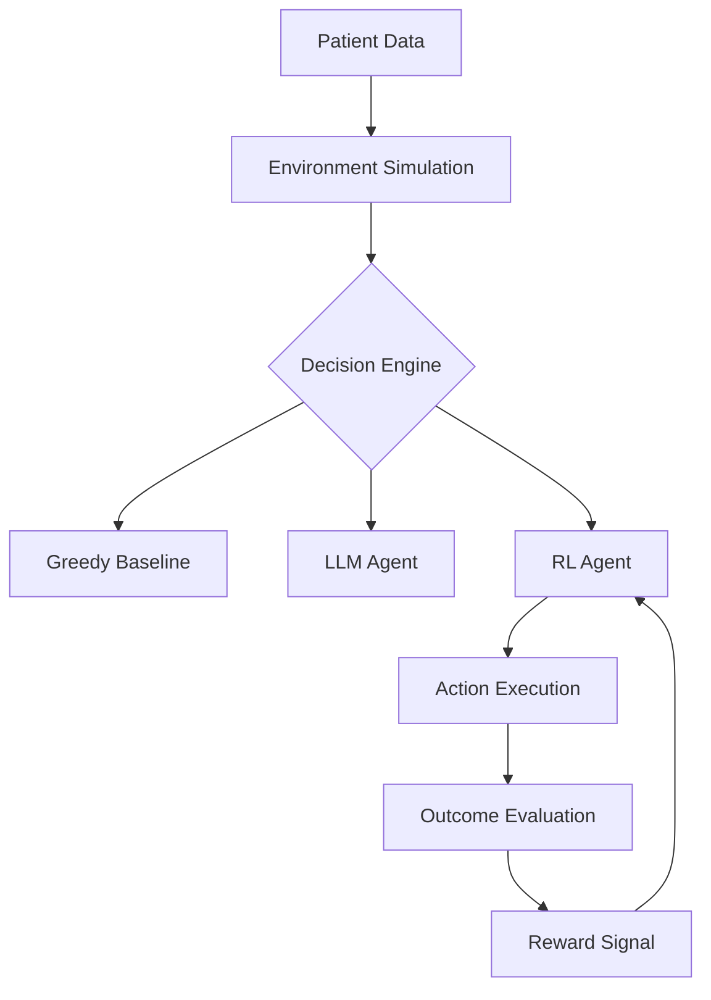

---

title: MedFlow OpenEnv
emoji: 🤖
colorFrom: green
colorTo: blue
sdk: docker
pinned: false
license: mit
short_description: Agentic Patient Prioritization System for AI agents
---

# 🏥 Agentic Patient Prioritization System (OpenEnv)


> **Note:** The system supports LLM-based agents via OpenAI/HuggingFace APIs and now includes a Reinforcement Learning (RL) agent for adaptive decision-making.
> A Greedy Baseline is provided for benchmarking.

---

## 🚀 Introduction

**MedFlow-OpenEnv** is an advanced simulation environment for **intelligent patient triage and resource allocation** under real-world constraints.

Unlike traditional queue systems, MedFlow enables **agentic AI systems** to reason, adapt, and learn in dynamic healthcare scenarios.

The system integrates multiple AI paradigms:

* ⚙️ **Greedy Baseline** → fast but rule-based
* 🧠 **LLM Agent** → context-aware reasoning
* 🤖 **RL Agent** → reward-driven learning and adaptation

> 💡 This progression demonstrates the evolution from **static rules → reasoning → learning-based intelligence**.

---

## 1. Project Overview & Agentic Vision

Modern AI is shifting toward **agentic systems** that can think, adapt, and optimize decisions dynamically.

MedFlow challenges agents to:

* Recognize patient severity and urgency
* Allocate resources intelligently (doctors, beds)
* Minimize critical wait times
* Operate under real-world constraints

👉 The goal:
**Build agents that behave like real triage experts, not rule-followers.**

---

## 2. Environment Logic (Core RL-Compatible Design)

### 🔹 Observation Space (State)

* Patient severity, priority, wait time
* Available doctors (specialization, status)
* Bed availability
* Current simulation time

---

### 🔹 Action Space

* Assign patient to doctor
* Prioritize patient in queue
* Discharge patient
* Wait (strategic no-op)

---

### 🔹 Reward Function

* **+0.15** → Emergency handled quickly
* **+0.10** → Efficient urgent handling
* **+0.05** → Normal treatment
* **-0.10** → Wrong specialization
* **-0.15** → Emergency delay
* **-0.05** → Resource overflow
* **0.0** → Wait

👉 This reward structure enables **Reinforcement Learning optimization**.

---

## 3. Decision-Making Paradigms

### 🔹 Greedy Baseline

* FIFO / rule-based
* No reasoning
* Limited adaptability

### Greedy Output

---

### 🔹 LLM Agent (Agentic Reasoning)

* Uses GPT-style reasoning
* Context-aware decision-making
* Flexible and intelligent

### LLM Output

---

### 🔹 RL Agent (Learning-Based)

* Implemented in `rl_agent.py`
* Uses **state → action → reward loop**
* Learns optimal policies via feedback
* Adapts to complex scenarios over time

### RL Output

---

### 📊 RL Evaluation Snapshot

```
[Task: easy_small_clinic] → Reward: 0.35  
[Task: medium_busy_opd] → Reward: 0.7  
[Task: hard_mass_casualty] → Reward: -2.35  
⚠️ Needs improvement  
```

> Lower performance in high-complexity scenarios highlights opportunities for further learning and optimization.

---

## 4. System Architecture



👉 Modular design enables **plug-and-play intelligence layers**.

---

## 5. Tech Stack & Tooling

* **Framework:** OpenEnv
* **Backend:** FastAPI
* **Core Logic:** Python
* **Agents:** OpenAI / HuggingFace APIs + RL Agent
* **Testing:** Pytest (40+ test cases)

---

## 6. How to Run

```bash
pip install -r requirements.txt
```

Create `.env`:

```env
OPENAI_API_KEY=your_key_here
```

### Run simulations:

**Greedy baseline**

```bash
python -m app.baseline --seed 42
```

**LLM agent**

```bash
python -m app.baseline_openai --seed 42
```

**RL agent**

```bash
python -m app.rl_agent --tasks easy_small_clinic medium_busy_opd hard_mass_casualty --seed 42
```

---

## 🎯 Design Philosophy

> Build once → plug multiple intelligence layers → compare reasoning vs learning vs rules.

---

## 🔮 Future Scope

* Replace dummy RL with Q-learning / Deep RL
* Hybrid LLM + RL agent
* Real-world hospital dataset integration

---

**Built for next-generation agentic AI systems 🚀**
